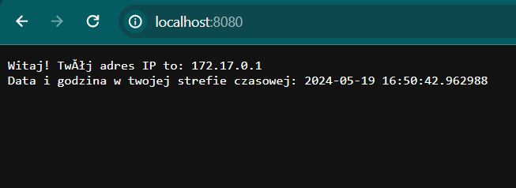
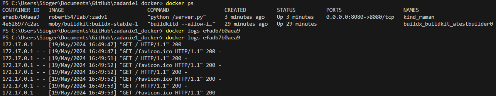
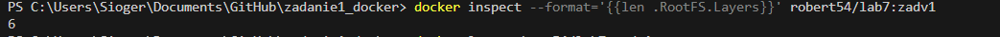

# docker-zadanie1-geoip-server-basic
This project showcases the process of building a Docker image with a server-side application that respond with the client's IP and time.

## Table of Contents

- [Requirements](#requirements)
- [Server application](#server-application)
- [Dockerfile](#dockerfile)
- [Image Building](#image-building)
- [Container Running](#container-running)
- [Diagnostics](#diagnostics)
- [Repository And Scouting](#repository-and-scouting)

## Requirements

W przypadku systemów Linux i Windows należy zainstalować i uruchomić Docker lub Docker Desktop. 

W przypadku systemów Windows należy zainstalować WSL.

## Server application

Kod aplikacji serwerowej wraz z komentarzami.

```php
import http.server
import socketserver
import datetime

# Definicja portu, na którym serwer będzie nasłuchiwał zgłoszenia klienta
PORT = 8080

# Definicja nazwy autora serwera
AUTHOR_NAME = "John Doe"

# Klasa obsługująca żądania HTTP
class MyHttpRequestHandler(http.server.SimpleHTTPRequestHandler):
    
    # Metoda obsługująca żądania typu GET
    def do_GET(self):
        # Pobranie adresu IP klienta
        client_ip = self.client_address[0]
        
        # Utworzenie wiadomości zawierającej adres IP klienta i aktualną datę i godzinę
        message = "Witaj! Twój adres IP to: {}\n".format(client_ip)
        message += "Data i godzina w twojej strefie czasowej: {}\n".format(datetime.datetime.now())
        
        # Wysłanie odpowiedzi do klienta
        self.send_response(200)
        self.send_header('Content-type','text/plain')
        self.end_headers()
        self.wfile.write(bytes(message, "utf8"))
        return

# Pobranie aktualnej daty i godziny w formacie "YYYY-MM-DD HH:MM:SS"
log_date = datetime.datetime.now().strftime("%Y-%m-%d %H:%M:%S")

# Wyświetlenie informacji o uruchomieniu serwera
print(f"Serwer uruchomiony przez: {AUTHOR_NAME}")
print(f"Data uruchomienia: {log_date}")
print(f"Serwer nasłuchuje na porcie: {PORT}")

# Uruchomienie serwera na podanym porcie
with socketserver.TCPServer(("", PORT), MyHttpRequestHandler) as httpd:
    httpd.serve_forever()

```

Server został uruchomiony na adresie http://localhost:8080.



## Dockerfile

Dockerfile z jedno etapowym budowaniem.

```dockerfile
FROM python:3.9-slim

LABEL author="John Doe"

ENV PORT=8080

COPY server.py /server.py

CMD ["python", "/server.py"]

```

## Image Building

Przykład dla Windows:

Uruchom poniższe polecenie, aby zbudować obraz. Jednocześnie obraz zostaje dodany do repozytorium na dockerhub z nazwą zadv1. Zmień wartość parametru „-t” na żądaną nazwę obrazu.

```cmd
docker buildx build -f Dockerfile -t robert54/lab7:zadv1 --sbom=true --provenance=true --push .
```

## Container Running

Uruchom poniższe polecenie, aby uruchomić kontener. Zmień wartość parametru „-p” na żądane porty.

```cmd
docker run -d -p 8080:8080 robert54/lab7:zadv1
```

## Diagnostics

Sprawdzanie logów kontenera serwera.

```cmd
docker logs efadb7b0aea9
```

Result:



Sprawdzanie liczby warstw obrazu.

```cmd
docker inspect --format='{{len .RootFS.Layers}}' robert54/lab7:zadv1
```

Result:



Nie ma zagrożeń krytycznych i są tylko 2 o wysokim stopniu ważności.

Link to this image: [hub.docker.com/layers/eyelor/zadanie1/geoip-server-basic/images/sha256-7c32d1136cca6b611a53eea12f8fa7c0c45b66b61c8119b7b5160d14c3abfdeb](https://hub.docker.com/layers/robert54/lab7/zadv1/images/sha256-5edabd72402740eb92fcc3dddcdcd95c38bd13e43ee1b8a29a74b1da910d4811?context=repo)
